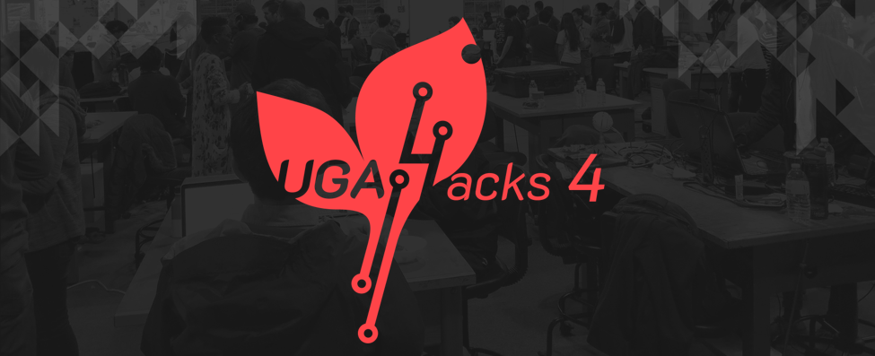

  

---

This website is the official website for UGA's 2019 hackathon, [UGAHacks 4](http://4.ugahacks.com/). It provides information about the hackathon for potential registrants, as well as a schedule and a link to registration. The site is written using vanilla HTML, CSS, and JavaScript.

Coded by [Jin Jeong](https://github.com/orangegarage) and [Paul Hansa](https://github.com/biggestcookie)
